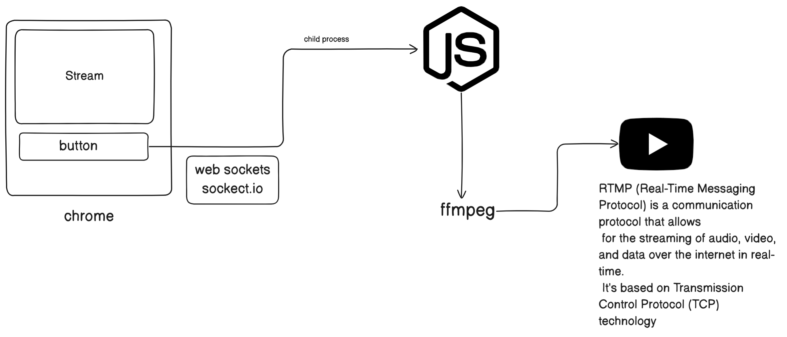

# Streaming Platform

This is a simple streaming platform that leverages **RTMP**, **FFmpeg**, and **Socket.io** for video streaming. The project uses **Express** for serving the application and **Socket.io** for real-time communication. The video stream is processed through **FFmpeg** and broadcast to YouTube via the **RTMP protocol**, all running inside a Docker container.

## Features

- Real-time video streaming to YouTube using RTMP
- FFmpeg for video processing
- Dockerized setup for easy deployment
- Socket.io for real-time communication (e.g., chat, stream events)
- Simple Express server to manage the application

## Prerequisites

- **Docker**: Make sure you have Docker installed on your machine. You can download it from [here](https://www.docker.com/get-started).
- **Node.js**: Ensure you have Node.js installed for development purposes. [Download Node.js](https://nodejs.org/).

## Installation

1. Clone the repository:

   ```bash
   git clone https://github.com/yourusername/streaming-platform.git
   cd streaming-platform
   ```

2. Install dependencies:
   ```bash
   npm install
   ```
3. Set up your Docker environment:
   ```bash
    docker build -t streaming-platform .
   ```
4. Update your YouTube Stream Key:

- Go to YouTube Studio.
- In the left sidebar, click on **Create > Go live**.
- Under the Stream settings, copy your **Stream Key**.

5. Update the configuration in the Docker container (or in your index.js file) to include your YouTube Stream URL and Stream Key.

## Architecture


